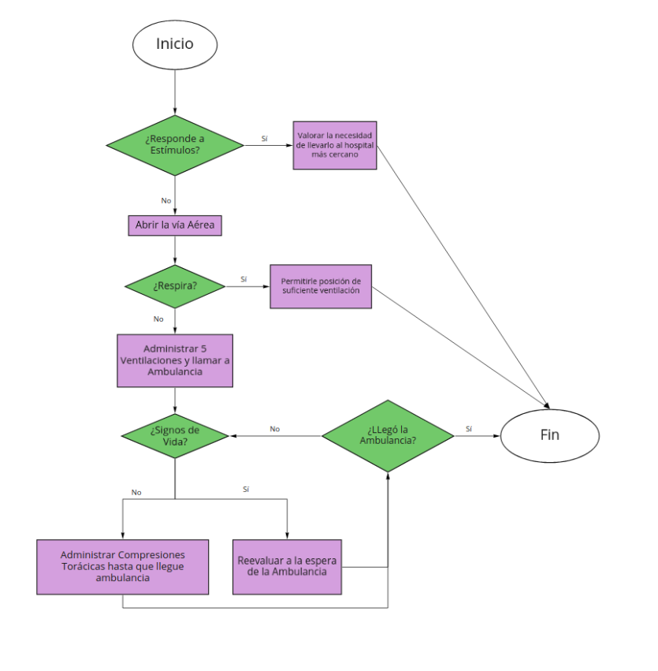

# Sentencias Condicionales e iterativas Parte II
En este repositorio se presenta el desarrollo para la actividad sobre Sentencias Condicionales e Iterativas Parte II.

## Descripción del proyecto

Este repositorio está compuesto por dos archivos: 
  - mayor_a_version1.py: este archivo corresponde a la solución (a) de la actividad 1
  - mayor_a_version2.py: este archivo corresponde a la solución (b) de la actividad 1
  - primeros_auxilios.py: este archivo corresponde a la solución de la actividad 2
  - fuerza_bruta_v1.py: este archivo corresponde a la solución de la actividad 3

## Actividad 1

### Solución (a)
Esta solución se basa solamente ocupando el Ciclo for, la cual nos permite nombrar la variable iteradora de cualquier manera. 
Para ello, nuesto objetivo se basa en poder aplicar el ciclo for a un diccionario. En este sentido, es necesario entender que un diccionario se compone de una clave y un valor, es por eso que la manera más común de iterar diccionarios es utilizando .items().

Entendiendo que el ciclo for para un diccionario se entiende como:
```
for clave, valor in diccionario.items():
```
Para nuestro trabajo ```mes``` corresponderá ```clave``` y ```venta``` corresponderá a ```valor``` y ```diccionario.items()``` se presentará como ```ventas.items()``` puesto que éste corresponde a nuestro diccionario. Por tanto:
```for mes, venta in ventas.items()```


### Solución (b)
Esta solución corresponde a la transformación de un ciclo for a un python comprehension. Basicamente, se sigue manteniendo la estructura de un ciclo for, solo que los elementos que están identados al ciclo se presentan de manera inversa.
Para entenderlo de una forma mucho más didáctica, el código se compone en tres partes: 1) ```clave```: ```valor```; 2) Ciclo for para un diccionario: 3) La condición del código. Esto queda representado de la siguiente manera:

```resultado = {mes: valor for mes, valor in ventas.items() if valor > umbral}```

## Actividad 2



## Actividad 3

## Autores y Autoras

- [Rosa Rubio](https://github.com/PaulinaRubioP)
- [Valery Maragaño](https://github.com/Valyxp)
- [Marco Alvarado](https://github.com/7pixel-cl)
- [Esteban Hernández](https://github.com/stivhc)
- [Claudia Aguayo](https://github.com/aguayo40)

⌨️ con ❤️ por el Grupo 5 - G20 😊
